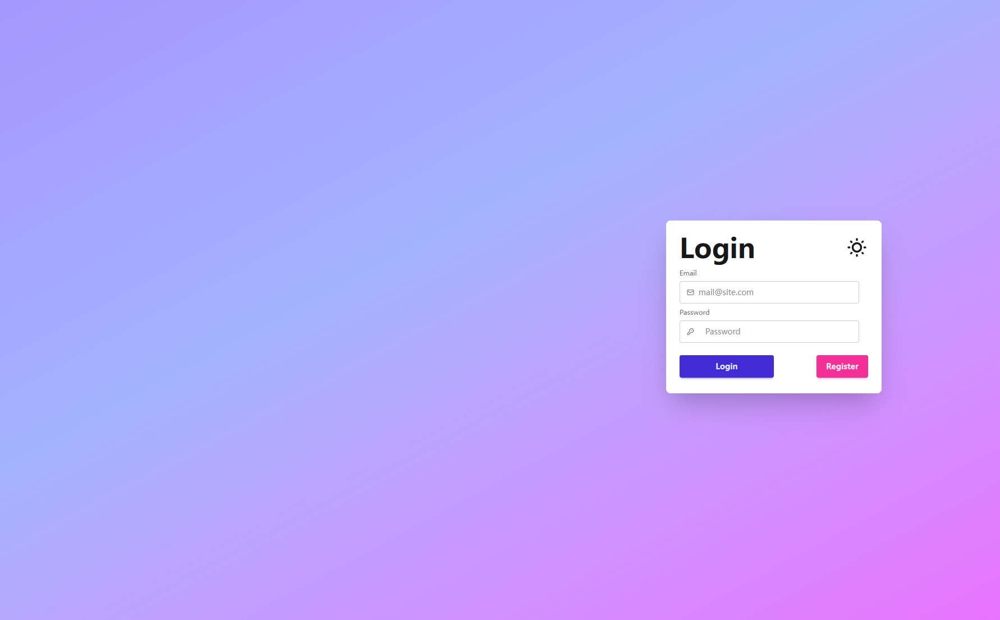
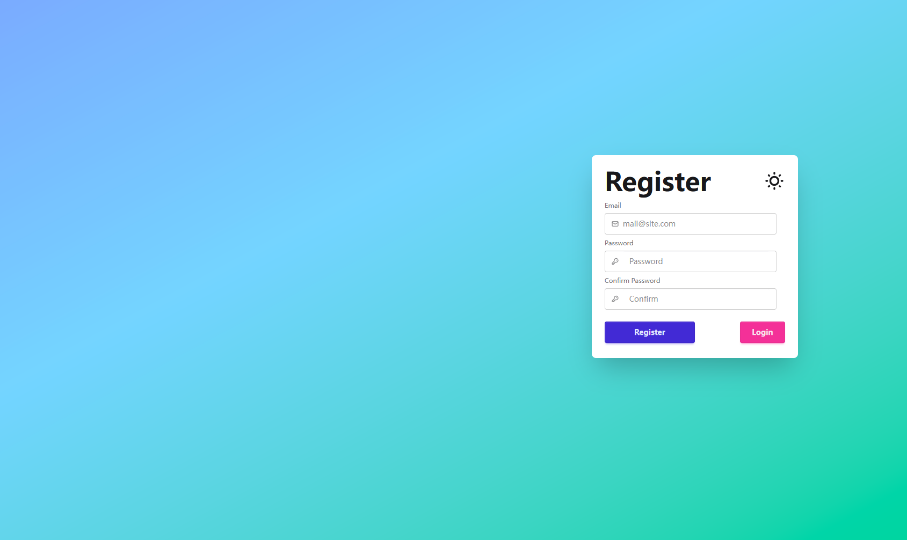
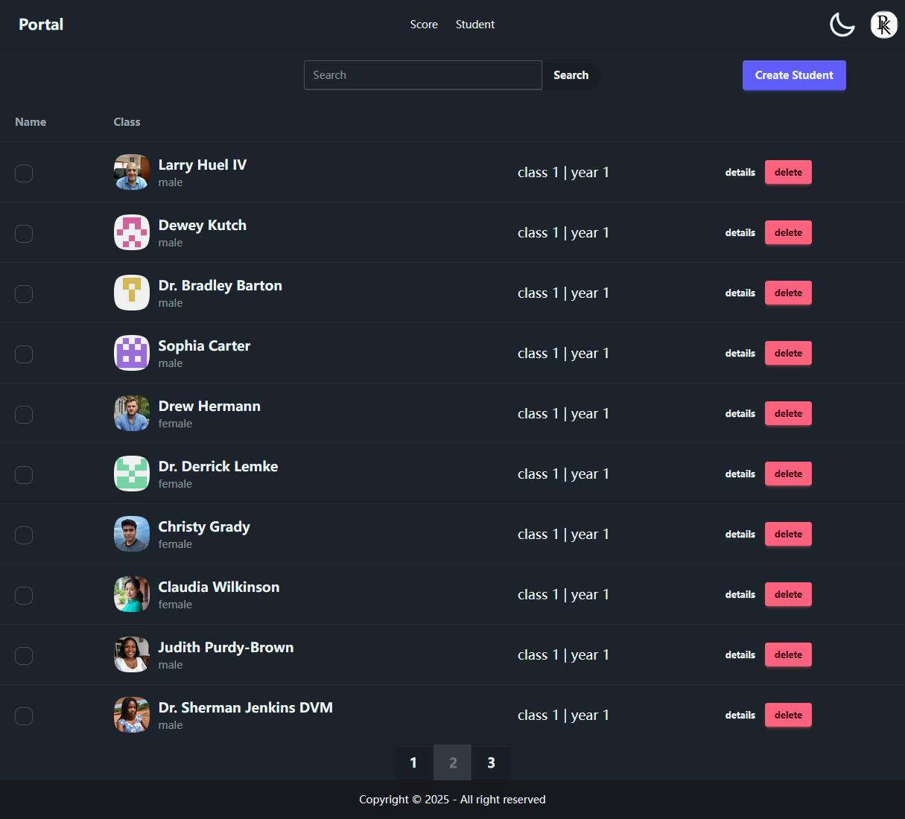
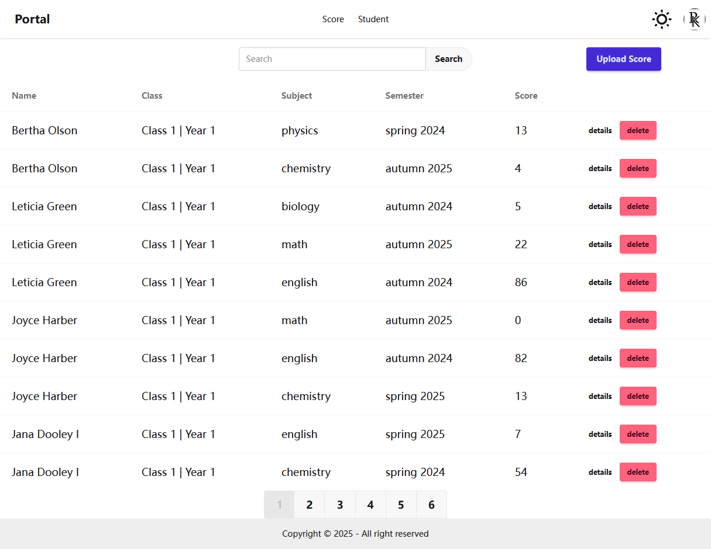

# Tiny Manage Portal

This is a simple [React](https://react.dev/) and TypeScript based user manage portal page. The UI is build with [TailwindCSS](https://tailwindcss.com/) and [DaisyUI](https://daisyui.com/) components. And both the database and user authentication utilizes [Supabase](https://supabase.com/).

This project utilizes [Jotai](https://jotai.org/) for React global state management. [React Hook Form](https://react-hook-form.com/) is adopted for a more clear and flex form data validaation. The data fetch as well as form submission are wrapped with [Tanstack React Query](https://tanstack.com/query) for a more robust and efficient error process.

<p>


</p>

## Environment

-   React: v19.1
-   TailwindCSS: v4.1
-   DaisyUI: v5.0
-   Vite: v7.0
-   Jotai: v2.12

To install the dependencies, please run:

```sh
npm install
```

To run the project on your local device, please run:

```sh
npm run dev
```

To build the project into a static website, please first create the `.env` file in the project root directory and add static values as:

```
VITE_SUPABASE_KEY=  // your supabase key
VITE_SUPABASE_URL=  // your supabase url
VITE_SUPABASE_TOKEN=  // token generated in your browser localstorage, only the value is needed
VITE_PAGE_SIZE=10
```

and then execute the following command:

```sh
npm run build
```

## Screenshots









## Demo

You can test this project here: [Demo](https://leafy-lolly-c81e09.netlify.app)

> Example Login Credential:  
> Email: Emmie.Mohr96@gmail.com  
> Password: iJkIQnYoLcbZx5H

## Acknowledge

-   HD_Alex
